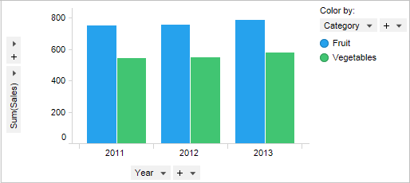

# Picachain

⚡️ Build quick LLM pipelines for your application, focused on image based use cases.

The objective of this project is to simplify the development of large language model pipelines that deals with images, charts, graphs and other unstructured elements. The most important aspects of the project is the integration of open-source libraries such as `transformers`, `diffusion` that powers the project-core.

In general, this project aims to cover all of the major LLM pipelines including the image generation, searching and conversation with images/charts and other unstructured data. 

## Things you can build with Picachain

### Image Search Engine
It supports `chromaDB` and `Pinecone` for image and vector storage. Search for similar images from the image repository and get the relevant/similar images quickly.

### Conversation with Images/Charts/Tables

Engage into conversation with charts and images. Ask questions and get detailed answers as response. 

:::note

Utilizes `GPT-3.5-turbo` to power the core Q&A engine. 

:::

## Quick start guide

This example covers how to use the picachain library to chat with your charts using the `ChartConversationChain`.

### Install Picachain

Install the `picachain` library into your machine. 

```bash
pip install picachain
```

If you have not installed the `torch` and `transformers` libraries, make sure to install them as well.
```bash
pip install picachain torch transformers
```

### Initiate the Chart conversation chain

You need to define the `OPENAI_API_KEY` as environment variable or create a `.env` file.

```python
# import dependencies
from dotenv import load_dotenv
from picachain.chains.unstructured.charts import ChartConversationChain
from picachain.models.openai.openai import OpenAI_Model
load_dotenv()
```

Now, initiate the Chain for conversation. We are going to use a bar-chart for Question-Answering.


> Fig1: Bar chart of sales for Fruits and Vegetables

```python
chart_conv_chain = ChartConversationChain(
    chart="chart.png"
)
response = chart_conv_chain.run(query="What is the total fruit sales in 2011?")
print(response)
```
> 'The total fruit sales in 2011 are 756.'

Continue the documentation to read more on how to setup different pipelines for various tasks and usage. 